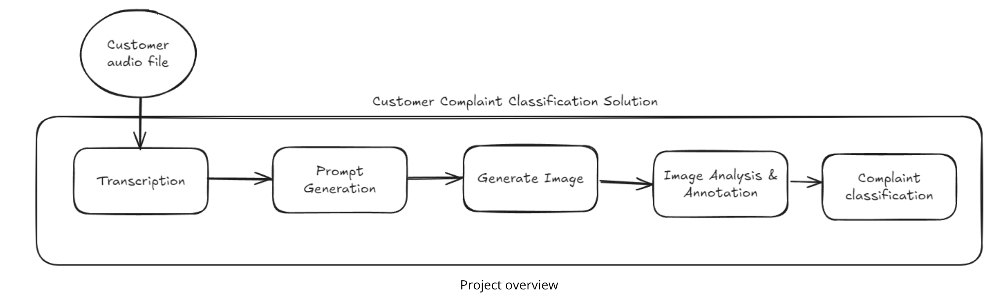

# customer-complaint-classification

The Customer Complaint Classification Solution project is an end-to-end AI-driven pipeline designed to automate the process of handling and categorizing customer complaints. 
This project simulates a real-world application where AI is employed to streamline customer support workflows by automating repetitive tasks and enhancing accuracy.

The solution takes audio complaints from customers and processes them through various stages to generate actionable insights. These stages include:

- **Audio Transcription**: Converting spoken complaints into written text using a speech-to-text model.
- **Prompt Generation**: Crafting a context-based prompt from the transcribed text to guide image generation.
- **Image Creation**: Using generative AI to create visual representations of the complaints for better understanding.
- **Image Description**: Analyzing the generated images to provide detailed descriptions of their contents.
- **Image Annotation**: Highlighting key areas in the images to draw attention to the main issue reported.

Complaint Classification: Categorizing the complaint into predefined categories and subcategories using AI models.

This project use generative AI models, such as OpenAI's Whisper for transcription, DALL-E for image generation, and GPT for language processing and classification. The goal is to integrate these models into a seamless pipeline, handle intermediate results, and manage data flow to create a robust, automated solution.

## . File Structure

Organize your project folder with the following structure:

    ├

## To run this project

- You need to install miniconda/anacond`
- Clone this project with the command git clone, then go to directory `customer-complaint-classification`
- Create virtual enviroment : conda env create -f conda.yaml 
- Activate virtual enviroment : conda activate venv
- Set you environment variable in .env file 
- then run project : python main.py

hint: if you want you can put your audio file complaint in the folder audio, then python main.py
